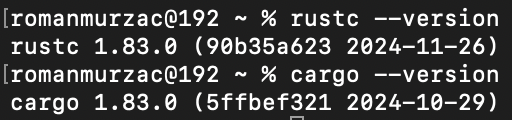

# Rustaceaner

My journey in learning the **Rust** programming language.

The name comes from the official documentation name for the people that use Rust - *Rustaceans*, respectively one person - *Rustacean*, and some customization from my side - *Rustaceaner*.

Here will be described the whole path from first search about Rust to the time to move to another repository for a serious project using Rust.

**Note:** The whole path is described using MacOS.

## Chapters
- [Information](#information)
- [Learning path](#learning-path)
- [Hello World](#hello-world)
- [Guess number](#guess-number)

## Information
**Search:** How hard is to learn Rust.\
**Prompt:** *rust compared to other languages*.\
**Result**: [Rust difficulty in comparison to other languages.](https://www.reddit.com/r/rust/comments/op2r7e/rust_difficulty_in_comparison_to_other_languages/?rdt=40201)

**Search:** How popular is the language.\
**Prompt:** *rust popularity*.\
**Result:** [Rust continues to be the most-admired programming language](https://www.reddit.com/r/rust/comments/1eb55ab/rust_continues_to_be_the_mostadmired_programming/).

**Search:** How paid is Rust.\
**Prompt:** *rust salary*.\
**Result:** [Rust Developer salary](https://web3.career/web3-salaries/rust-developer).

## Learning path
There are a lot of free resources to learn. Searching for most suitable for me, I came to the conclusion that the official documentation will be the best starting point. I started with [The Rust Programming Language](https://doc.rust-lang.org/book/title-page.html) book *by Steve Klabnik and Carol Nichols, with contributions from the Rust Community*.

## Prepare environment
First step is to make Rust available on the local machine - MacOS.\
In a terminal enter the command below to install Rust.
```
curl --proto '=https' --tlsv1.2 -sSf https://sh.rustup.rs | sh
```


After Rust installation check if the programming language was installed successfully by using command below.
```
rustc --version
```

Also, to make sure that the package manager was installed successfully use the command below.
```
cargo --version
```


For the journey I use VS Code with *rust-analyzer* extension.\


## Hello world
As a consacrated way of starting learn a programming language, first program written in that specific language is *Hello World* and here no exception.\
The *Hello World* project will be stored in `chapter_1` directory. Use the commands below to create the working directory and to move to it.
```
mkdir chapter_1
cd Rustaceaner/chapter_1 
```

Create the first Rust file named `main.rs` paste the content from file with same name, and build it.
```
rustc main.rs 
```

After the file was built, execute it using the command below and the result will be displayed in the terminal.
```
./main 
```


## Hello cargo
For projects with higher complexity than *Hello World* will be used `Cargo` package manager.\
Initialize a new project using *cargo* package manager named `chapter_2` using the command below. The output will be a brand new project directory that contains `src` directory where all code will be located and the default *Hello World* file is generated. Also, there is generated `Cargo.toml` file that contains project metadata and all necessary dependencies for current project.
```
cargo new chapter_2
```


As the default file `main.rs` is generated it can be built using a cargo command from below.
```
cargo build
```
After the building the project it can be run using the path to the project as per command below. By default, there is created working version that is fast compiled, but is not optimized and it is stored in `target/debug` subdirectory.
```
./target/debug/chapter_2 
```


It can be run using cargo specific command - *cargo run*.
```
cargo run
```


In development process it is antiproductive to build and run the project at every line of code that was written. To bust productivity during development process there is a specific command shown below that just will check the code.
```
cargo check
```


If there is an error in the code as in example below, on line 2 are missing some elements, on check command the error will be catched.


After development phase, for production code there should be used another command to compile the code. This command optimize the code execution. It is slower in compiling, but faster in execution of the compiled code.
```
cargo run --release
```


When there are used a *crate* - Rust collection of source code, if it is necessary to update the version of the crates use the command below.\
*Binary crate* - executable project, as *project_2* that ws created.\
*Library crate* - code to be used in other projects, non-executable.
```
cargo update
```
The structure of the project after run for development and for production purpose is as per image below.\


## Guess number
Initialize the 3rd chapter for a new project.
```
cargo new chapter_3
```

Replace the content of the `main.rs` with the content from below. Check the code and run it - compile and execute.
```
use std::io;

fn main() {
    println!("Guess the number!");

    println!("Please enter your guess number: ");

    let mut guess = String::new();

    io::stdin()
    .read_line(&mut guess)
    .expect("Failed to read line");

    println!("You guessed: {}", guess);
}
```


Beside *errors* that can occur in the code, there are also *warnings*. If from code above delete the `expect` and the code will not handle possible erorrs, there will be a warning as in image below.\


To use *crates* that are not built-in, there is need to add them in the *Cargo.toml* under *[dependencies]* section as per example below. And on new build apply it will install all necessary dependencies and the outside crates are usable in the code.
```
[dependencies]
rand = "0.8.5"
```


As the crates are new to the user, to read the documentation there should be run a special command to generate the documentation and open o local.
```
cargo doc --open
```


Use the code from `chapter_3/src/main.rs` for the final version of the chapter and play with the second code created using Rust.
